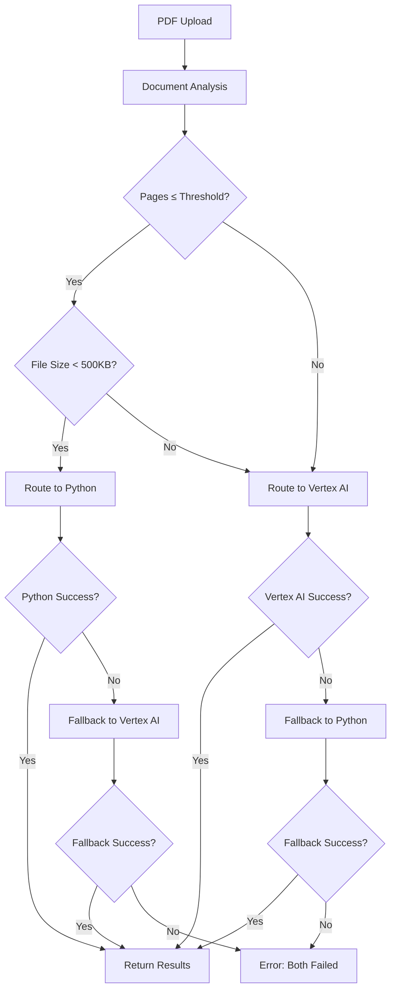

# BAS Chat - Hybrid PDF Extraction Architecture

## Current Hybrid Architecture (Production Ready)

### Hybrid Extraction Pipeline ✅

The application now features an intelligent hybrid extraction system that automatically optimizes costs while maintaining accuracy:

#### **Main Hybrid Route** ✅
- **`/api/extract-pdf-hybrid`** - Intelligent hybrid extraction with automatic engine selection

#### **Legacy Routes** ✅ 
- **`/api/extract-pdf-langextract`** - Direct Python LangExtract service
- **`/api/extract-pdf-serverless`** - Mock data for testing (Vercel-safe)
- **`/api/extract-pdf`** - Legacy route with Python service fallback

#### **Test/Debug Routes** ✅
- **`/api/test-hybrid-extraction`** - Test hybrid routing logic and configuration
- **`/api/test-simple-categorization`** - Test direct Google AI categorization
- **`/api/test-simple-ai`** - Test basic AI connectivity
- **`/api/test-pdf-extraction`** - Test PDF extraction with realistic mock data
- **`/api/test-ai`** - Test complex AI categorization flow
- **`/api/env-check`** - Environment variable verification

## Hybrid Extraction System

### Intelligent Engine Selection

The hybrid system automatically analyzes documents and routes them to the optimal extraction engine:

#### Python/PyMuPDF Engine (Cost-Effective)
- **Target Documents**: Single-page, simple financial documents
- **Triggers**: Pages ≤ `EXTRACT_PAGE_LIMIT_FOR_PYTHON` AND file size < 500KB
- **Technology**: FastAPI + PyMuPDF + Pydantic schemas
- **Benefits**: Fast processing, minimal cost, high accuracy for simple docs
- **Timeout**: 30 seconds

#### Vertex AI Engine (High Accuracy)
- **Target Documents**: Multi-page or complex financial documents  
- **Triggers**: Pages > `EXTRACT_PAGE_LIMIT_FOR_PYTHON` OR file size ≥ 500KB
- **Technology**: Google Generative AI (Gemini 2.5 Flash Lite)
- **Benefits**: Superior accuracy for complex layouts and formats
- **Timeout**: 60 seconds

### Routing Logic Flow



### Configuration Variables

```env
# Hybrid extraction routing threshold
EXTRACT_PAGE_LIMIT_FOR_PYTHON=1

# Vertex AI model selection
VERTEX_AI_MODEL=gemini-2.5-flash-lite

# Enable comprehensive logging
ENABLE_EXTRACTION_LOGGING=true

# Service endpoints
LANGEXTRACT_SERVICE_URL=http://localhost:8084
GOOGLE_GENAI_API_KEY=your_api_key_here
```

## Technical Implementation

### Unified Schema Compliance ✅

Both extraction engines return data in a standardized format:

```typescript
interface ExtractionResult {
  transactions: Array<{
    date: string;
    description: string;
    amount: number;
  }>;
  pageCount: number;
  transactionCount: number;
  extractionEngine: 'python' | 'vertex-ai';
  extractionTime: number;
  confidence?: number;
}
```

### Error Handling & Fallback ✅

1. **Primary Engine Selection**: Based on document analysis
2. **Automatic Fallback**: If primary fails, try secondary engine
3. **Comprehensive Error Reporting**: Clear messages when both engines fail
4. **Timeout Management**: Appropriate timeouts for each engine type

### Monitoring & Cost Optimization ✅

#### Extraction Logging
```json
{
  "timestamp": "2025-01-XX",
  "engine": "python|vertex-ai|hybrid",
  "success": true,
  "pageCount": 1,
  "transactionCount": 15,
  "executionTime": 2500,
  "fileName": "statement.pdf",
  "fileSize": 45000
}
```

#### Cost Tracking Benefits
- **Monitor Engine Usage**: Track Python vs Vertex AI usage patterns
- **Optimize Thresholds**: Tune `EXTRACT_PAGE_LIMIT_FOR_PYTHON` based on data
- **Performance Analytics**: Compare extraction times and success rates
- **Error Rate Monitoring**: Identify patterns in extraction failures

## Production Environment Setup

### Required Environment Variables

```env
# Core Configuration
GOOGLE_GENAI_API_KEY=your_actual_api_key_here
LANGEXTRACT_SERVICE_URL=https://your-python-service.com
EXTRACT_PAGE_LIMIT_FOR_PYTHON=1
VERTEX_AI_MODEL=gemini-2.5-flash-lite
ENABLE_EXTRACTION_LOGGING=true

# Optional Service URLs
PYTHON_EXTRACTOR_URL=http://localhost:8000  # Legacy support
```

### Python Service Deployment

1. **Local Development**: 
   ```bash
   cd services/python-extractor
   python langextract_main.py
   ```

2. **Production**: Deploy to Vercel/Render/Google Cloud, update `LANGEXTRACT_SERVICE_URL`

### Frontend Integration

The dashboard automatically uses the hybrid extraction pipeline:

```typescript
// Automatic engine selection - no user interaction required
const result = await extractWithHybridService(file);
// Returns unified schema regardless of engine used
```

## Real Data Extraction Features

- **Intelligent Routing**: Automatically selects optimal extraction engine
- **Cost Optimization**: Minimizes Vertex AI usage for simple documents
- **High Accuracy**: Uses Vertex AI for complex multi-page documents
- **Robust Fallback**: Ensures extraction even if primary engine fails
- **Performance Monitoring**: Comprehensive logging for optimization
- **Unified Output**: Consistent schema from both engines
- **Error Resilience**: Clear error handling when extraction fails

## Vercel Build Status ✅

- **CLEAN**: No problematic Node.js PDF libraries  
- **HYBRID**: Intelligent extraction routing implemented
- **READY**: Serverless functions deploy without errors
- **COST-OPTIMIZED**: Minimizes Vertex AI usage through smart routing
